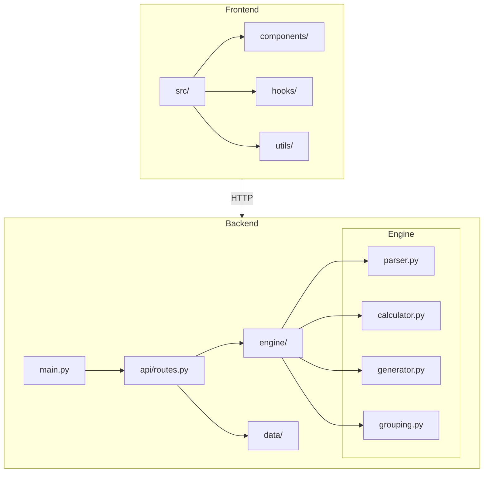

# Project Architecture

```mermaid
graph TD
  subgraph Frontend
    Fsrc["src/"]
    Fcomponents["components/"]
    Fhooks["hooks/"]
    Futils["utils/"]
    Fsrc --> Fcomponents
    Fsrc --> Fhooks
    Fsrc --> Futils
  end

  subgraph Backend
    Bmain["main.py"]
    Bapi["api/routes.py"]
    Bengine["engine/"]
    Bdata["data/"]
    Bmain --> Bapi
    Bapi --> Bengine
    Bapi --> Bdata

    subgraph Engine
      Eparser["parser.py"]
      Ecalculator["calculator.py"]
      Egenerator["generator.py"]
      Egrouping["grouping.py"]
    end

    Bengine --> Eparser
    Bengine --> Ecalculator
    Bengine --> Egenerator
    Bengine --> Egrouping
  end

  Frontend -->|HTTP| Backend
```
